<!-- ╔══════════════════════════════════════════════════════════════════╗ -->
<!--                       AHSAN TARIQ · README                        -->
<!-- ╚══════════════════════════════════════════════════════════════════╝ -->

<div align="center">

<!-- ANIMATED GRADIENT HEADER -->
<a href="https://github.com/TariqDreamsTech">
  
</a>

<!-- ANIMATED TYPING TAGLINE -->
<a href="https://github.com/TariqDreamsTech">
  
</a>

<br/>

<!-- SOCIAL BADGES -->
<p>
  <a href="mailto:ahsantariq0724@gmail.com"></a>
  <a href="https://linkedin.com/in/ahsan-tariq-0724-/"></a>
  <a href="https://github.com/TariqDreamsTech"></a>
  <a href="https://ranbval.com"></a>
  <a href="https://jerichoai.io"></a>
</p>

<!-- LIVE METRIC BADGES -->
<p>
  
  
  
</p>

</div>

---

##  &nbsp;Who I Am

```yaml
name:       Ahsan Tariq
role:       Lead AI Automation & Backend Systems Architect
current:    Building production-grade AI products end-to-end
focus:      [ Multi-Agent LLMs, Vector Search, Zero-Knowledge Systems, Cloud-Native Backends ]
location:   Pakistan  →  building for the world  🌍
motto:      "First solve the problem. Then write the code."
```

I architect AI systems that survive production traffic — multi-agent LLM pipelines, vector search infrastructure, zero-knowledge encryption platforms, and the boring-but-critical glue that holds them all together. I'm equally at home in **FastAPI**, **LangGraph**, **Cloud Run**, and a 4 AM debugging session.

---

##  &nbsp;My Products

<div align="center">

### 🌐 The Ranbval Ecosystem
*An intentional constellation of AI-native products — each solves one hard problem, and every one runs live in production.*

<a href="https://ranbval.com"></a>


</div>

<br/>

<!-- ═══════════ FLAGSHIP PRODUCTS ═══════════ -->

<table>
<tr>
<td width="50%" valign="top">

### 🔐 [Ranbval — Secrets Vault](https://ranbval.com)
*Zero-knowledge API key & password manager. A leaked key is useless outside its bound environment.*

```diff
+ AES-256-GCM encryption at rest
+ Universal secure proxy engine
+ Git origin / domain binding policies
+ MFA + session revocation & governance
+ Python + JavaScript SDKs (PyPI + npm)
+ Real-time telemetry & audit dashboard
```
<sub>**📦** [`ranbval-sdk`](https://pypi.org/project/ranbval-sdk/) on npm + PyPI · **🔒** 100K+ keys secured · **⚡** <10ms decryption</sub>

</td>
<td width="50%" valign="top">

### 🏥 [Ranbval Health](https://health.ranbval.com)
*AI Operating System for Healthcare — automating the entire patient journey.*

```diff
+ AI voice appointment booking (24/7)
+ Digital check-in + centralized profile
+ Ask-the-AI case assistant on records
+ AI pre-visit briefings for doctors
+ Smart e-prescriptions + allergy checks
+ Labs, billing & follow-ups in one flow
```
<sub>**👨‍⚕️** Doctors · Clinics · Labs · Pharmacies · Hospitals · **🔐** End-to-end encrypted · **Founder & CEO**</sub>

</td>
</tr>

<tr>
<td width="50%" valign="top">

### 🧠 [Ranbval Social](https://socialapp.ranbval.com)
*"The Living Network" — AI-native social super-app with relationship intelligence.*

```diff
+ Multi-persona AI agents w/ memory
+ Real-time chat / voice / video (E2EE)
+ Relationship intelligence engine
+ Gaming layer + AI leaderboards
+ View-once media & secure data vault
+ Trust & moderation w/ AI intervention
```
<sub>**👥** 10K+ beta users · **💬** 50K+ daily interactions · **🛰** WebSockets @ <50ms</sub>

</td>
<td width="50%" valign="top">

### 📄 [Ranbval Resume Shortlister](https://resume.ranbval.com)
*AI hiring engine + student career coach — dual-mode intelligence.*

```diff
+ JD-grounded strict scoring w/ evidence
+ 8-dimension per-requirement scorecard
+ AI "who to interview" tie-breaker
+ Queue-based concurrent scoring pipeline
+ Gap analysis + tailored resume rewrite
+ Auto-extract contacts + admin dashboard
```
<sub>**⚙** FastAPI · Supabase · OpenAI · Vercel serverless · **📊** Hundreds screened / batch</sub>

</td>
</tr>

<tr>
<td width="50%" valign="top">

### 🎬 [Ranbval Discovery](https://discovery.ranbval.com)
*Content Intelligence OS — AI video analysis & clip extraction at scale.*

```diff
+ Deepgram transcription pipeline
+ OpenAI-powered highlight ranking
+ FFmpeg clip extraction engine
+ Searchable transcript indexing
+ FastAPI async orchestration
```
<sub>**🎥** Long-form → ranked highlights · **🔎** Full-text search across every frame</sub>

</td>
<td width="50%" valign="top">

### 💬 [Ranbval Conversations](https://conversations.ranbval.com)
*Unified client-communications inbox — every channel, one platform.*

```diff
+ Multi-channel message aggregation
+ AI-assisted triage & smart replies
+ Unified thread history & context
+ Team collaboration on threads
+ One inbox, zero switching cost
```
<sub>**📥** Email · SMS · WhatsApp · Web · **🤖** AI drafts replies you actually send</sub>

</td>
</tr>

<tr>
<td width="50%" valign="top">

### ⚡ [24n8n](https://24n8n.ranbval.com)
*Productized, always-on n8n + LLM automation services.*

```diff
+ 24/7 managed workflow hosting
+ Pre-built automation templates
+ LLM integration out of the box
+ SLA-backed uptime guarantees
+ Custom workflow engineering
```
<sub>**🔁** For teams tired of babysitting n8n · **⏱** Deploy in hours, not weeks</sub>

</td>
<td width="50%" valign="top">

### 🚀 [Volvexer](https://volvexer.site)
*Enterprise automation & workflow services — bespoke integrations.*

```diff
+ Custom n8n + Zapier architectures
+ Multi-system data orchestration
+ AI-powered business process design
+ End-to-end delivery + support
```
<sub>**🏢** For enterprises · **🛠** From consultation to production</sub>

</td>
</tr>
</table>

<!-- ═══════════ CLIENT / ENTERPRISE WORK ═══════════ -->

<div align="center">

### 💼 Enterprise Systems I've Built

*Production-grade platforms shipped for clients — architecture, backend, and AI systems.*

</div>

<table>
<tr>
<td width="50%" valign="top">

### 👁 Qira — AI Service Ops
*Facial analytics + multilingual avatar AI on Cloud Run.*

```diff
+ 468-landmark facial analysis (MediaPipe)
+ EN↔RU context-aware translation
+ OpenAI TTS w/ Redis cache (<100ms repeat)
+ Firebase real-time backbone
+ 1000+ concurrent requests @ <50ms
```
<sub>**🎯** 98% attribute accuracy · **🌐** 1M+ translations · **⚙** FastAPI on GCP Cloud Run</sub>

</td>
<td width="50%" valign="top">

### 📝 LLHAM — Proposal AI
*Multi-agent proposal generation platform.*

```diff
+ LangGraph state-based orchestration
+ Master / BA / Architect / PM agents
+ RAG over PostgreSQL vector store
+ Streaming WebSocket responses
+ 100K+ documents indexed (<100ms search)
```
<sub>**🤖** 5 specialised agents · **💼** 1K+ proposals · **🔻** -40% token usage, -80% latency</sub>

</td>
</tr>

<tr>
<td width="50%" valign="top">

### 🏢 Ambica — Enterprise Ops Portal
*Multi-tenant FastAPI portal on GCP — 37 modules across HR, Finance & Ops.*

```diff
+ Live NetSuite ERP data pipeline (Celery)
+ 3-layer OTP security framework
+ DocuSign + MS Graph + Google OAuth
+ Cloud Build CI/CD w/ pre-commit gates
+ Finance Intelligence: P&L, AR, Cashflow
```
<sub>**⚙** GCP Cloud Run · PostgreSQL 18 · **📊** Live NetSuite-synced KPIs</sub>

</td>
<td width="50%" valign="top">

### 🧬 InstaMailAI — Vector Search
*Semantic email understanding at scale.*

```diff
+ MongoDB Atlas Vector Search + RAG
+ FastAPI email processing pipeline
+ 500+ emails/minute throughput
+ Hybrid metadata + vector filtering
+ 70% query latency reduction
```
<sub>**📧** 5M+ emails indexed · **⚡** <50ms similarity search · **🧠** LangChain + OpenAI</sub>

</td>
</tr>
</table>

<!-- ═══════════ OPEN SOURCE ═══════════ -->

<div align="center">

### 🌱 Open Source & Personal

</div>

| Project | What it does | Stack |
|---|---|---|
| **[ISGC](https://github.com/ahsantariq7/isgc)** | GPA/CGPA calculator CLI for IUB students — handles variable credit hours | `Python` |
| **[Emotion Analysis](https://github.com/ahsantariq7/emotion_analysis)** | PyPI package — transformer-based multi-class emotion classifier with FRNN + OWA weighting, NLP preprocessing, word clouds | `Python` · `Transformers` · `NLP` |
| **[Laptop Monitoring System](https://github.com/ahsantariq7/Linux-Monitoring-System)** | Captures intruder image on login via webcam, emails alert via SMTP — cross-platform | `Python` · `OpenCV` · `smtplib` |

---

##  &nbsp;Tech Stack

<div align="center">

**Languages**


**Backend · AI · Frameworks**


**Databases & Vector Stores**


**Cloud & DevOps**


**Tools**


</div>

---

##  &nbsp;Career Journey

<table>
<tr>
<td width="160" valign="top"><b>2026 — Now</b><br/><sub>Lahore · Onsite</sub></td>
<td>
<b>🚀 Lead AI Automation & Backend Systems Architect</b> · <i>Savvy Programmers</i><br/>
Leading <b>Qira</b>, n8n + Gemini automation ecosystems, Monday.com + Zapier CRM governance, Voiceflow booking AI, and multi-agent LinkedIn intelligence pipelines.
</td>
</tr>
<tr>
<td valign="top"><b>2026 — Now</b><br/><sub>Global · Self-Initiated</sub></td>
<td>
<b>🛠 Founder & Product Engineer</b> · <i>TariqDreamsTech (Ranbval)</i><br/>
Designed, built, and shipped <b>Ranbval Health, Secrets Vault, Social, Resume Shortlister, Discovery, Conversations, 24n8n & Volvexer</b> end-to-end. Architecture, backend, SDKs, deployment — solo.
</td>
</tr>
<tr>
<td valign="top"><b>2025 — 2026</b><br/><sub>Remote</sub></td>
<td>
<b>⚡ AI Engineer · Backend & DevOps</b> · <i>Ambica International</i><br/>
Architected a multi-tenant FastAPI enterprise portal on GCP Cloud Run — 37 modules, 10K+ DAU, live NetSuite ERP sync, DocuSign + MS Graph + OAuth integrations, full CI/CD.
</td>
</tr>
<tr>
<td valign="top"><b>2024 — 2025</b><br/><sub>USA · Remote</sub></td>
<td>
<b>🔧 Backend Software Engineer</b> · <i>Artilence</i><br/>
QPharma (AWS data eng) · 2456.ai (FastAPI + Pinecone) · NVIT multi-tenant SaaS · Seanz Firm interview AI · LLHAM multi-agent proposal AI.
</td>
</tr>
<tr>
<td valign="top"><b>2025</b><br/><sub>Venezuela · Remote</sub></td>
<td>
<b>🔁 n8n Engineer</b> · <i>hddisenos</i><br/>
1M+ events/month automation pipelines across HubSpot, Zoho, Sheets, SOAP/REST APIs.
</td>
</tr>
<tr>
<td valign="top"><b>2025</b><br/><sub>USA · Remote</sub></td>
<td>
<b>🧬 Vectorized Database Engineer</b> · <i>InstaMailAI</i><br/>
5M+ emails indexed at <50ms — Mongo Atlas Vector + RAG + FastAPI.
</td>
</tr>
<tr>
<td valign="top"><b>2022 — Now</b></td>
<td>
<b>⭐ Freelance Python Developer</b> · <i>Fiverr</i> · 5-star rating · 50+ projects
</td>
</tr>
</table>

---

##  &nbsp;By The Numbers

<div align="center">

| 🔐 Keys Secured | 📨 Emails Indexed | 🤖 AI Calls Served | 👥 Users Reached | 💰 Revenue Influenced |
|:---:|:---:|:---:|:---:|:---:|
| **100K+** | **5M+** | **5M+/mo** | **10K+ DAU** | **$5M+** |

</div>

---

##  &nbsp;Publications & Identifiers

- 📄 **Main Author** — *A Python Package For Summarizing University Student Examination Performance* (ResearchGate, 2024)
- 📋 **Peer Reviewer** — Asian Journal of Economics, Business and Accounting · Asian Journal of Agricultural Extension · Book of Innovation and Technology for Economic Growth
- 🪪 **ORCID:** `0009-0005-0673-8369` · **Web of Science:** `OMK-7734-2025`
- 💡 **LeetCode:** 81 problems · **Kaggle:** Expert

---

##  &nbsp;Proficiency & Impact

<div align="center">

<!-- CUSTOM ANIMATED DARK DASHBOARD -->


</div>

---

##  &nbsp;GitHub at a Glance

<div align="center">


<br/><br/>

<!-- DARK PROFILE SUMMARY CARDS -->


</div>

---

##  &nbsp;Let's Connect

<div align="center">

If you're hiring, building something ambitious, or just want to argue about LangGraph vs vanilla agents — my inbox is open.

<a href="mailto:ahsantariq0724@gmail.com"></a>
<a href="https://linkedin.com/in/ahsan-tariq-0724-/"></a>
<a href="https://ranbval.com"></a>

<br/><br/>


<sub><i>Crafted with too much coffee and a strong opinion on production-grade Python ☕</i></sub>

</div>
